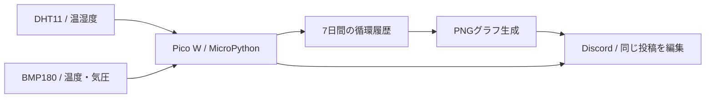

# pico-climate-bot

[](https://github.com/aida0710/pico-climate-bot/actions/workflows/tests.yml)

Raspberry Pi Pico Wだけで動く、Discord向けの室内環境モニター。

DHT11で温湿度、BMP180で温度・気圧を測定し、約5分ごとにDiscordの同じメッセージを更新します。直近7日間の温湿度グラフもPico内で生成します。PCや別サーバーの常時稼働、外部の画像生成サービスは不要です。



## できること

- 最新の温湿度・気圧を表示し、480×272の温湿度グラフを差し替え。
- 最大2016件の履歴と投稿IDを本体に保存。再起動後も同じ投稿を更新。
- 時刻を確認できた後は、通信断中も測定履歴を保存。
- HTTPタイムアウト、Wi-Fi再接続、ウォッチドッグによる停止からの復旧。
- Macからテスト・バックアップ・USB転送・転送後の照合。

Discord REST APIを呼び出す投稿専用Botです。`discord.py`、Gateway接続、チャット受信・コマンド操作は使用しません。グラフは記録開始以降の実測値だけを表示し、未取得期間は空白になります。

## はじめる

### 1. コードを取得・テスト

```sh
git clone https://github.com/aida0710/pico-climate-bot.git
cd pico-climate-bot
python3 pico.py test
```

追加パッケージのインストールは不要です。このテストはPicoへの接続やDiscordへの送信を行いません。

### 2. Discord Botを用意

[Discord Developer Portal](https://discord.com/developers/applications)でBotを作り、使用するサーバーへ招待します。対象のテキストチャンネルで、チャンネル閲覧・メッセージ履歴参照・メッセージ送信・埋め込みリンク・ファイル添付を許可してください。

### 3. Picoに設定を保存

MicroPythonを導入済みのPicoへ、`config.example.py` を元にした `config.py` を保存します。Thonnyなどのファイル転送機能を使用し、本体のルートに置いてください。

```python
WIFI_SSID = 'YOUR_WIFI_SSID'
WIFI_PASSWORD = 'YOUR_WIFI_PASSWORD'
BOT_TOKEN = 'YOUR_BOT_TOKEN'
BOT_CHANNEL_ID = 'YOUR_CHANNEL_ID'
BOT_APPLICATION_ID = 'YOUR_APPLICATION_ID'
```

## コード構成

| パス | 役割 |
| --- | --- |
| `firmware/main.py` | 測定ループ、時刻同期、Wi-Fi接続、停止対策 |
| `firmware/pico_discord.py` | Bot認証、初回投稿・編集、PNGの分割送信 |
| `firmware/pico_history.py` | CRC付き固定長の循環履歴 |
| `firmware/pico_chart.py` | MicroPython上のPNG生成 |
| `firmware/libs/bmp180.py` | BMP180ドライバー |
| `pico.py`、`tools/` | テスト・USB転送・バックアップ |
| `tests/` | ハードウェア不要の回帰テスト |

測定間隔は `INTERVAL_S`、メッセージ本文は `collect_message()` で変更できます。表示時刻はJSTです。開発中の作業方法は[CONTRIBUTING.md](CONTRIBUTING.md)を参照してください。

## データと動作の制約

| 本体内のファイル | 内容 |
| --- | --- |
| `climate.bin` | 最大2016件・24,192バイトの循環履歴 |
| `climate.png` | 約67 KBのグラフ。約65 KBの描画バッファで生成 |
| `discord_state.json` | 投稿IDと初回作成の試行状態 |
| `health.log`、`health.log.1` | 各4 KiB以下の稼働・エラーログ |

画像は1 KBずつ送信し、API応答の読み込みは16 KiBまでに制限します。グラフは温度・湿度の別パネルで、15分を超える欠測区間の線をつなぎません。気圧は本文のみです。

## ライセンスとクレジット

BMP180ドライバーにはSebastian Plamauer氏によるMITライセンスのコードが含まれます。著作権・ライセンス表記は[ドライバー冒頭](firmware/libs/bmp180.py)に保持しています。
